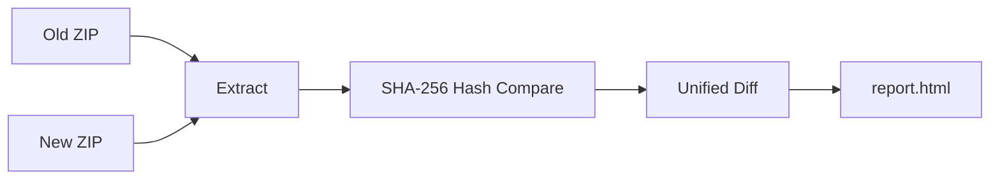

<p align="center">
  
  
  
</p>

<h1 align="center">🔍 New Code Scanner</h1>

<p align="center">
  <b>Fast & memory-efficient code difference analyzer</b><br>
  Compare two versions of a codebase and generate a premium HTML diff report.
</p>

---

## ✨ Features

- 🎯 **Unified Diff View** — Shows only the changes with line numbers, no noise
- 🎨 **Premium Dark-Themed Report** — Beautiful, modern HTML report with glassmorphism design
- 🔎 **Search & Filter** — Search files by path, filter by Added / Deleted / Modified
- 📦 **Zero Dependencies** — Uses only Python standard library
- 💾 **Memory Efficient** — Streams ZIP extraction and file reads; won't blow up your RAM
- ⌨️ **Keyboard Shortcuts** — Press `E` to expand all, `C` to collapse all
- 📂 **Organized Output** — Extracts files and report into a project-named folder

## 🚀 Quick Start

```bash
git clone https://github.com/furkan1x337/new-code-scanner.git
cd new-code-scanner
python3 scanner.py
```

The tool will prompt you for:

| # | Prompt | Description |
|---|--------|-------------|
| 1 | **Project Name** | Used as the output folder name |
| 2 | **Analyst Name** | Your name, shown in the report header |
| 3 | **Old Version ZIP** | Path to the `.zip` of the old codebase |
| 4 | **New Version ZIP** | Path to the `.zip` of the new codebase |

## 📸 Example

<div align="center"><pre>
  
```
╔═══════════════════════════════════════════════════════════════════════╗
║                                                                       ║
║   ███╗   ██╗███████╗██╗    ██╗     ██████╗ ██████╗ ██████╗ ███████╗   ║
║   ████╗  ██║██╔════╝██║    ██║    ██╔════╝██╔═══██╗██╔══██╗██╔════╝   ║
║   ██╔██╗ ██║█████╗  ██║ █╗ ██║    ██║     ██║   ██║██║  ██║█████╗     ║
║   ██║╚██╗██║██╔══╝  ██║███╗██║    ██║     ██║   ██║██║  ██║██╔══╝     ║
║   ██║ ╚████║███████╗╚███╔███╔╝    ╚██████╗╚██████╔╝██████╔╝███████╗   ║
║   ╚═╝  ╚═══╝╚══════╝ ╚══╝╚══╝     ╚═════╝ ╚═════╝ ╚═════╝ ╚══════╝    ║
║                                                                       ║
║     ███████╗ ██████╗ █████╗ ███╗   ██╗███╗   ██╗███████╗██████╗       ║
║     ██╔════╝██╔════╝██╔══██╗████╗  ██║████╗  ██║██╔════╝██╔══██╗      ║
║     ███████╗██║     ███████║██╔██╗ ██║██╔██╗ ██║█████╗  ██████╔╝      ║
║     ╚════██║██║     ██╔══██║██║╚██╗██║██║╚██╗██║██╔══╝  ██╔══██╗      ║
║     ███████║╚██████╗██║  ██║██║ ╚████║██║ ╚████║███████╗██║  ██║      ║
║     ╚══════╝ ╚═════╝╚═╝  ╚═╝╚═╝  ╚═══╝╚═╝  ╚═══╝╚══════╝╚═╝  ╚═╝      ║
║                                                                       ║
║                  Version 1.0  •  Code Diff Analyzer                   ║
╚═══════════════════════════════════════════════════════════════════════╝

  📋  Project Information
  ▸ Project Name: Avengers
  ▸ Analyst / Developer Name: Tony Stark

  📦  ZIP File Paths
  ▸ Old Version ZIP path: old_release.zip
  ▸ New Version ZIP path: new_release.zip

  📂  Extracting ZIP files ...
    ✔ 142 files extracted
    ✔ 148 files extracted

  🔍  Analyzing differences ...

  📊  Scan Complete!
  Total changed files : 12
  ➕  Added           : 3
  ➖  Deleted         : 1
  ✏️   Modified        : 8

  📄  Report saved to: /Avengers/report.html
```
</pre></div>

## 📁 Output Structure

```
MyProject/
├── old_version/      # Extracted old ZIP contents
├── new_version/      # Extracted new ZIP contents
└── report.html       # Generated diff report
```

## 📊 Report Features

The generated `report.html` includes:

- **Summary Dashboard** — Total changes, added, deleted, modified counts at a glance
- **Collapsible Sections** — All file diffs start collapsed; click to expand
- **Unified Diff Format** — Standard unified diff with line numbers

```diff
--- old/app/api.php
+++ new/app/api.php
@@ -3,4 +3,5 @@
-    $result = $db->query("SELECT * FROM users WHERE id=$id");
+    $stmt = $db->prepare("SELECT * FROM users WHERE id=?");
+    $stmt->execute([$id]);
```

- **Color-Coded Lines** — 🟢 Green for additions, 🔴 Red for deletions
- **Search Bar** — Instantly filter files by path
- **Type Filters** — Toggle between All / Added / Deleted / Modified

## ⚙️ How It Works



1. **Extract** — ZIPs are extracted one file at a time in 64KB chunks
2. **Hash Compare** — Files are first compared by SHA-256 hash to skip identical files quickly
3. **Diff** — Changed text files are diffed line-by-line with Python's `difflib`
4. **Report** — HTML is written incrementally to disk

## 🛡️ Memory Safety

| Concern | Solution |
|---------|----------|
| Large ZIP files | Streamed extraction in 64KB chunks |
| Large files (>100MB) | Skipped from diff analysis |
| Binary files | Detected and skipped (extension + null-byte check) |
| HTML output | Written incrementally, not buffered |

## 📋 Requirements

- **Python 3.7+**
- No external packages needed — stdlib only

## 📄 License

This project is licensed under the MIT License - see the [LICENSE](LICENSE) file for details.

---
